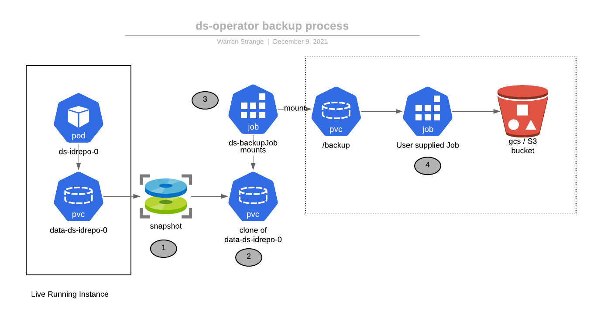

# ForgeRock Directory Service Operator - ds-operator

The ds-operator deploys
the [ForgeRock Directory Server](https://www.forgerock.com/platform/directory-services)
 in a Kubernetes cluster. This
is an implementation of the [Kubernetes Operator](https://kubernetes.io/docs/concepts/extend-kubernetes/operator/) pattern.

Basic features of the operator include:

* Creation of StatefulSets, Services and Persistent volume claims for the directory
* Configures replication by adding new directory pods to the replication topology
* Change service account passwords in the directory using a Kubernetes secret.
* Take Volume Snapshots of the directory disk, and restore a directory based on a snapshot
* Backup and Restore directory data to LDIF format.

Please see the annotated [hack/ds-kustomize](hack/ds-kustomize) for the annotated reference of the DirectoryService custom resource specification.

Developers please refer to the [developers guide](DEVELOPMENT.md).


## Install the Operator

**Important: Only one instance of the operator is required per cluster.**

ForgeRock developers: This is already installed on the `eng-shared` cluster.

The [install.sh](install.sh) script will install the latest release of the operator. You can also curl this script:

```bash
curl  -L  "https://github.com/ForgeRock/ds-operator/releases/latest/download/install.sh" -o /tmp/install.sh
chmod +x /tmp/install.sh
/tmp/install.sh install
```

The operator runs in the `fr-system` namespace. To see log output use kubectl:

```bash
kubectl -n fr-system get pods
kubectl logs -n fr-system  -l  control-plane=ds-operator -f
# or if you have stern installed...
stern -n fr-system ds-
```

## Deploy a Directory Instance

Once the ds-operator has been installed, you can deploy an instance of the directory service using the sample in [hack/ds-kustomize].

Below is a sample deployment session

```bash
kubectl apply -k hack/ds-kustomize.yaml

# pw.sh script will retrieve the uid=admin password:
./hack/pw.sh

# View the pods, statefulset, etc
kubectl get pod

# Scale the deployment by adding another replica
kubectl scale directoryservice/ds-idrepo --replicas=2

# You can edit the resource, or edit the ds.yaml and kubectl apply changes
# Things you can change at runtime include the number of replicas
kubectl edit directoryservice/ds-idrepo

# Delete the directory instance.
kubectl delete -k hack/ds-kustomize

# If you want to delete the PVC claims...
kubectl delete pvc data-ds-0
```

The directory service deployment creates a statefulset to run the directory service. The usual
`kubectl` commands (get, describe) can be used to diagnose the statefulsets, pods, and services.

## Directory Docker Image

The deployed spec.image must work in concert with the operator. There are sample Dockerfiles in the ForgeOps project. You must use the
most recent "dynamic" ds image in https://github.com/ForgeRock/forgeops/tree/master/docker/ds/ds.

Evaluation images have been built for you on us-docker.pkg.dev/forgeops-public/images/ds. The [ds.yaml](hack/ds-kustomize/ds.yaml) Custom Resource references this image.

The entrypoint and behavior of the docker image is important. If you want to make changes please consult the README for the ds image in forgeops.

## Secrets

The operator supports creating (some) secrets, or a bring-your-own secrets model.

The operator can generate random secrets for the `uid=admin` account, `cn=monitor` and application service accounts (for
example - the AM CTS account). Refer to the annotated sample.

Kubernetes cert-manager is the recommended way to generate PEM certificates for the directory deployment.
The included sample in [hack/ds-kustomize/cert.yaml](hack/ds-kustomize/cert.yaml) creates certificates for the master and SSL keypairs.

However, cert-manager is not a requirement. Any valid PEM certificates can be used for the directory deployment.
For example, you could use `openssl` commands to generate the PEM key pairs. All certificates must be of secret type `kubernetes.io/tls`.

WARNING: It is _extremely_ important to backup the  master key pair. Directory data is encrypted using the master keypair, and if it is lost your directory data will be unrecoverable.

## Scheduling

The operator provides the following control over scheduling:

* The pods will tolerate nodes that have been tainted with the following:
  * `kubectl taint nodes node1 key=directory:NoSchedule`.
* Tainting
 such nodes will help them "repel" non directory workloads, which can be helpful for performance.  If nodes are not tainted,
 this toleration has no effect. This should be thought of as an optional feature that most users will not require.
* Topology Constraints: The DS nodes will _prefer_ to be scheduled on nodes and zones that do not have other directory pods on them. This is
  "soft" anti-affinity.  DS pods will still be scheduled on the same node if the scheduler is not able to fulfill the request.

## Volume Snapshots

Beginning in Kubernetes 1.20, [Volume Snapshots](https://kubernetes.io/docs/concepts/storage/volume-snapshots/) are generally
available. Snapshots enable the creation of a rapid point-in-time snapshot of a disk image.

The ds-operator enables the following auto-snapshot features:

* The ability to initialize directory server data from a previous volume snapshot. This process
is much faster than recovering from backup media. The time to clone the disk will depend on the provider,
but in general will happen at block I/O speeds.
* The ability to schedule snapshots at regular intervals, and to automatically delete older snapshots.

Use cases that are enabled by snapshots include:

* Rapid rollback and recovery from the last snapshot point.
* For testing, initializing the directory with a large amount of sample data saved in a previous snapshot.


### Snapshot Prerequisites

* The cloud provider must support Kubernetes Volume Snapshots. This has been tested on GKE version 1.18 an above.
* Snapshots require the `csi` volume driver. Consult your providers documentation. On GKE enable
  the `GcePersistentDiskCsiDriver` addon when creating or updating the cluster. The forgeops `cluster-up.sh` script
  for GKE has been updated to include this addon.
* For production usage, snapshots must be atomic and "crash consistent". Consult your providers documentation. Note the csi hostpath
driver does not meet this criteria and is only used for testing.
* You must create a `VolumeSnapshotClass`. The default expected by the ds-operator is `ds-snapshot-class`. The `cluster-up.sh` sample script creates
  this class using the following definition
```yaml
apiVersion: snapshot.storage.k8s.io/v1beta1
kind: VolumeSnapshotClass
metadata:
  name: ds-snapshot-class
driver: pd.csi.storage.gke.io
deletionPolicy: Delete
EOF
```

* The VolumeSpec in the ds-operator deployment yaml should also use a CSI driver. When enabling the `GcePersistentDiskCsiDriver` addon, GKE will automatically
  create two new storage classes: `standard-rwo` (balanced PD Disk) and `premium-rwo` (SSD PD disk).

### Initializing the Directory Server from a Previous Volume Snapshot

Edit the Custom Resource Spec (CR) and update the `dataSource` field to point to the snapshot.
See [Create a PersistentVolumeClaim from a Volume Snapshot](https://kubernetes.io/docs/concepts/storage/persistent-volumes/#create-persistent-volume-claim-from-volume-snapshot).

The snapshot name can be any valid DS snapshot in the same namespace. The name `$(latest)` is special, and will
be replaced by the latest auto-snapshot taken by the operator.


A "rollback" procedure is as follows:

* Validate that you have a good snapshot to rollback to. `kubectl get volumesnapshots`.
* Delete the directory deployment *and* the PVC claims.  For example: `kubectl delete directoryservice/ds-idrepo-0 && kubectl delete pvc ds-idrepo-0` (repeat for all PVCs).
* Set the `dataSource` either to "$(latest)" (assuming the operator is taking snapshots) or the name of a specific volume snapshot.
* Redeploy the directory service.  The new PVCs will be cloned from the snapshot.
* *All* directory instances are initialized from the same snapshot volume. For example, in a two way replication topology,
  ds-idrepo-0 and ds-idrepo-1 will both contain the same starting data and changelog.

*WARNING*: This procedure destroys any updates made since the last snapshot. Use with caution.

### How the Operator Manages Persistent Volume Claims

The operator pre-creates Persistent Volume Claims (PVCs) before they are created by the statefulset volume claim template. Statefulsets are largely
"immutable" and this restriction means that a PVC volume source can not be updated after the statefulset is deployed. This prohibits
the ability to update the volume source of a new PVC to a more recent volume snapshot. The recent snapshot could be
one created by the operator, or a snapshot that is manually created by an administrator.

An example scenario: The administrator scales the directory service from one replica to two. They likely want to create the new PVC
from a recent snapshot of the first replica to rapidly seed the second replica. By pre-creating the PVC before the statefulset is scaled, the
PVC can use a volume source from the most recent snapshot.

Note that PVC claims that are already provisioned are never overwritten by Kubernetes. If you manually create a PVC,
the operator will not overwrite it.

Because the operator pre-creates PVCs, the volume claim template of the Statefulset may differ from the actual PVC definition. For
example, if the administrator did not initially create the PVC from snapshots, they could edit the DirectoryService resource and
enable:

```yaml
spec:

  replicas: 2 # Update from 1 to 2 replicas

  ....
  podTemplate:
    volumeClaimSpec:
      # Set the source of the new PVC to be a snapshot
      dataSource:
            name: "$(latest)"
            kind: VolumeSnapshot
            apiGroup: snapshot.storage.k8s.io
```

And then `kubectl apply` the updated resource. When the directory is scaled, the new PVC will be initialized from the most recent snapshot

### Enabling Automatic VolumeSnapshots

The ds-operator can be configured to automatically take snapshots. Update the CR spec:

```yaml
snapshots:
  enabled: true
  # Take a snapshot every 20 minutes
  periodMinutes: 20
  # Keep this many snapshots. Older snapshots will be deleted
  snapshotsRetained: 3
```

Snapshot settings can be dynamically changed while the directory is running.

Notes:

* Only the first PVC (data-ds-idrepo-0 for example) is used for the automatic snapshot. When initializing from a snapshot,
  all directory replicas start with the same data (see above)
* Snapshots can be expensive. Do not snapshot overly frequently, and retain only the number of
  snapshots that you need for availability. Many providers rate limit the number of snapshots that can be created. GCP
  limits the number of snapshots to 6 per hour per PVC.
* Snapshots are not a replacement for offline backups. If the data on disk is corrupt, the snapshot will also
  be corrupt.
* The very first snapshot will not happen until after the first `periodMinutes` (20 minutes in the example above).
  This is to give the directory time to start up before taking the first snapshot.

### Advanced Snapshot Scenarios

You can manually take snapshots at any time assuming you are using the CSI driver. For example

```
kubectl apply -f - <<EOF
apiVersion: snapshot.storage.k8s.io/v1beta1
kind: VolumeSnapshot
metadata:
  name: my-great-snapshot-1
spec:
  volumeSnapshotClassName: ds-snapshot-class
  source:
    persistentVolumeClaimName: data-ds-idrepo-0
EOF
```

You can pre-create PVC claims, causing Kubernetes to ignore the PVC claim template created by the operator.
For example, if you wanted to initialize a 3rd directory instance with a specific snapshot, apply
the following *before* the PVC is created by the operator:

```yaml
apiVersion: v1
kind: PersistentVolumeClaim
metadata:
  annotations:
    pv.beta.kubernetes.io/gid: "0"
  labels:
  name: data-ds-idrepo-2
spec:
  accessModes:
  - ReadWriteOnce
  resources:
    requests:
      storage: 5Gi
  storageClassName: standard-rwo
  dataSource:
    apiGroup: snapshot.storage.k8s.io
    kind: VolumeSnapshot
    name: my-cool-snap-1
```

## Multi-cluster (Preview)

The DirectoryServer can be configured across multiple clusters located in the same or different geographical regions for high availability or DR purposes.

By overriding and passing the DS_BOOTSTRAP_SERVERS and DS_GROUP_ID environment variables, you can configure
replication across multiple clusters. The requirements:

* The DS pods must be directly reachable across all clusters.
* Pods must have a resolvable DNS name across all clusters.

Multi-cluster is an advanced use case. You must thoroughly understand how to configure cross cluster networking and DNS resolution
before attempting to setup DS multi-cluster.

We describe using [CloudDNS for GKE doc](https://github.com/ForgeRock/forgeops/blob/master/etc/multi-cluster/google-cloud/clouddns/README.md) in the forgeops repo.

To enable multi-cluster, configure the following environment variables in the custom resource:

* DS_GROUP_ID must contain the cluster identifier as described in the CloudDNS docs(e.g. "eu" for EU cluster). This variable
 is appended to the pod hostname in each cluster to form a name that is unique across all ds instances in the topology. For example,
the pod `ds-idrepo-0` has the same name in the both the `us` and `eu` clusters. Appending the group id (say `eu`) makes the DS server id unique.
Note that that group name is NOT used to form a DNS resolvable name. It exists for DS to disambiguate instances.
* DS_BOOTSTRAP_REPLICATION_SERVERS enumerates the servers to bootstrap the cluster. This should include at least one server in each cluster.
These dns names must resolve in all clusters.


Example env configuration for ds-idrepo on EU cluster:

CloudDNS:
```yaml
  env:
    - name: DS_GROUP_ID
      value: "eu"
    - name: DS_BOOTSTRAP_REPLICATION_SERVERS
      value: "ds-idrepo-0.ds-idrepo.prod.svc.eu:8989,ds-idrepo-0.ds-idrepo.prod.svc.us:8989"
```

## Backup and Restore

The operator supports two new Custom Resources:

* [DirectoryBackup](hack/ds-backup.yaml)
* [DirectoryRestore](hack/ds-restore.yaml)

These resources are used to create backups (tar, LDIF or dsbackup) and restore them again. Backup
data is stored on a persistent volume claim specified by the DirectoryBackup Custom Resource.

Taking a DirectoryBackup does the following:

* Snapshots and then clones a PVC with the contents of the directory data.
* Runs a directory server binary pod, mounting that PVC
* Exports the data in one or more formats (tar, LDIF or dsbackup). The data is exported to the backup PVC.

The process flow is diagrammed below:



When the process concludes, the PVC with the data can be further processed. For example
you can mount that PVC on a pod that will export the data to GCS or S3. This design
provides maximum flexibility to BYOJ (bring your own Job) for final archival. A sample Job
that exports the data to GCS can be found in [tests/gcs](tests/gcs).

You can backup a "live"  directory instance as the snapshots on most cloud providers are "crash consistent". However,  it is recommended to perform an LDIF backup in addition to other types to validate that the snapshot data is readable and consistent.

Deleting a `DirectoryBackup` resource deletes the  associated volume snapshot and PVC clone but it retains the backup PVC.

Taking a DirectoryRestore does the following:

* Creates a new 'data' PVC to hold the restored directory data
* Runs a job that mounts an existing backup PVC (likely the one created by a DirectoryBackup above) and
 performs an data import into the directory data PVC.
* Creates a volume snapshot of the directory data PVC

On conclusion of a restore, the volume snapshot can be used to initialize or recover a new directory instance by using it
as the Volume Source of a DirectoryService instance.

For day to day backup of directory data, prefer to use tools such as [velero.io](https://velero.io). Ldif export and import
is useful to validate the integrity of the database, and for long term archival storage where a text based
format is preferred.

## Putting it all together

A sample workflow to deploy a directory server, backup that server, destroy the PVC, then restore the backup, would
look like this:

```bash
# Create a new directory instance (and associated certs)
kubectl apply -k hack/ds-kustomize
# after deployment, wait for the pod to be ready... Make some changes using your favorite ldap tool. Then take a backup
kubectl apply -f hack/ds-backup.yaml
# When the backup completes... lets tear it all down
kubectl delete -f hack/ds-backup.yaml
kubectl delete -k hack/ds-kustomize
# Oh no - the data is gone!!! 
kubectl delete pvc data-ds-idrepo-0
# Lets restore the backup
kubectl apply -f hack/ds-restore.yaml
# When the restore completes you should have a volume snapshot called ds-restore
# volume snapshots are ready when the READYTOUSE column shows "true"
kubectl get volumesnapshot
# Edit hack/ds-kustomize/ds.yaml. Set the PVC volume source to the ds-restore snapshot above
# Now redeploy the directory server:
kubectl apply -k hack/ds-kustomize
# You should see the restored data appear in the directory server.
# You can also scale the directory. The backup snapshot will be used as the source for new pods:
kubctl scale directoryservice --all --replicas=2
```

## Migration

Migrating from a previous deployment of the directory server to the ds-operator is a two step process:

* Migrate the required secrets. In particular, the ds master keypair must be migrated to
 the Kubernetes `tls` secret type. Both the old and the new directory server instances must share
 the same master keypair.
* Migrate the data. This can be done using LDIF import/export, restoring from a backup, or via replication.
This example demonstrates using replication. The new server will be connected to
the existing server, and receive all the data via replication.

Considerations:

* The schema must be compatible with the two deployments.
* Directory deployments prior to 7.1.1 did not replicate schema. The new ds-operator image replicates
schema. However, as long as the schema is compatible migration can proceed.


The scenario described below is supported by the sample files in the [hack/migration](hack/migration) directory.

The sample assumes a 7.1.1 directory server instance `ds-idrepo` is running in the `default` namespace, and we are migrating
the data to a directory server instance `ds-idrepo` deployed by the directory operator in the `ds` namespace.
This procedure will also works across cluster instances if pod DNS resolution is configured correctly. See
the multi-cluster documentation for more details.

### Migration Steps

Edit the `hack/cp-sa-secrets.sh` script to match your environment
In this example the original deployment secrets are in the `default` namespace, and the new
ds-operator deployment will be in the `ds` namespace

```bash
kubectl create ns ds
kubectl ns ds
# Edit and run this script
cd hack/migration
./cp-sa-secrets.sh
# the script generates secrets in /tmp. Apply them:
kubectl apply -f /tmp/sa-secrets/ssl-tls.yaml
kubectl apply -f /tmp/sa-secrets/master-tls.yaml
# You should backup these generated secrets in the `ds` namespace!!!
# Remember - if you lose the master keypair, you will lose the data!
#
# Apply the password secrets - these are for the uid=admin and monitor users
k apply ./secrets.yaml

```

The directory deployment sets two environment variables that will assist in migration. Edit
 `ds.yaml` in the migration directory, and make sure the following variables are uncommented in the `spec.env` section:

```yaml
  - name: DS_BOOTSTRAP_REPLICATION_SERVERS
      value: "ds-idrepo-0.ds-idrepo.default.svc.cluster.local:8989,ds-idrepo-0.ds-idrepo.ds.svc.cluster.local:8989"
  - name: DS_GROUP_ID
      value: "ds"
```

The `DS_BOOTSTRAP_REPLICATION_SERVERS` variable adds the original primary server in the `default` namespace to
the replication topology. This will cause the new server to connect to the original primary server and
replicate data.

Setting `DS_GROUP_ID` is required so that this server has a  unique server id that is distinct from the original primary server.
If we don't set this, both servers would be identified as the server id ds-idrepo-0-default.

You can now deploy the new directory server instance:

```bash
kubectl apply -f ds.yaml

```

Once the server has started, you should see it connect to the primary server. You can verify this by execing into the pod
and running:


```bash
default-scripts/rstatus

```
Note that you will see errors related to the generation id. You can ignore these errors for now, as we
we are going to reinitialize the new server with all the data from the primary server.

For each backend that you want to migrate, run the following command in the ds-idrepo-0 pod of the new server instance:

```bash
dsrepl initialize --baseDn $BACKEND_OU --fromServer ds-idrepo-0 --bindDN "uid=admin" --bindPasswordFile  /var/run/secrets/admin/dirmanager.pw  --hostname localhost --port 4444 --trustAll
```


For this scenario, the following commands were used:

```bash
dsrepl initialize --baseDn ou=am-config --fromServer ds-idrepo-0 --bindDN "uid=admin" --bindPasswordFile  /var/run/secrets/admin/dirmanager.pw  --hostname localhost --port 4444 --trustAll
dsrepl initialize --baseDn ou=identities --fromServer ds-idrepo-0 --bindDN "uid=admin" --bindPasswordFile  /var/run/secrets/admin/dirmanager.pw  --hostname localhost --port 4444 --trustAll
dsrepl initialize --baseDn dc=openidm,dc=forgerock,dc=io --fromServer ds-idrepo-0 --bindDN "uid=admin" --bindPasswordFile  /var/run/secrets/admin/dirmanager.pw  --hostname localhost --port 4444 --trustAll
dsrepl initialize --baseDn  ou=tokens --fromServer ds-idrepo-0 --bindDN "uid=admin" --bindPasswordFile  /var/run/secrets/admin/dirmanager.pw  --hostname localhost --port 4444 --trustAll
```

Once complete, these commands will have replicated the data from the original server to the new server.

## Disconnecting Replication

When you are ready, the final step is to disconnect and sever replication between the two servers. This
is done by resetting the `DS_BOOTSTRAP_REPLICATION_SERVERS` to its original value (or just let it default), and
restarting *ALL* servers that might know about each other. If you only restart the new server, you
will see the original server in the default namespace still trying to replicate data to the new server.

Edit `ds.yaml` in the migration directory, comment out the following:

```yaml
  #- name: DS_BOOTSTRAP_REPLICATION_SERVERS
  #  value: "ds-idrepo-0.ds-idrepo.default.svc.cluster.local:8989,ds-idrepo-0.ds-idrepo.ds.svc.cluster.local:8989"
  # - name: DS_GROUP_ID
  #   value: "ds"
```

Restart the instances:

```bash
# Scale down the primary server (or delete)
kubectl -n default scale sts ds-idrepo --replicas=0
# Delete the ds deployment, but retain the PVC!
kubectl -n ds delete -f ds.yaml
# Now restart the new server
kubectl -n ds apply -f ds.yaml
```


## Changelog

* v0.2.4 - Persistent Volume Claims are now pre-created. This allows updating the volume claim source at runtime.
* v0.2.next - `spec.podTemplate.certificates` renamed to `spec.PodTemplate.secrets` to better reflect the purpose.
* v0.2.0 - Add Support for Backup and Restore in LDIF, Tar and DSBackup formats.
 Migrate to cert-manager to issue PEM certificates for the directory server pods.
 Introduce a new common podTemplateSpec the Directory, Bacup and Restore Custom Resources.
* v0.1.0 - Initial release
